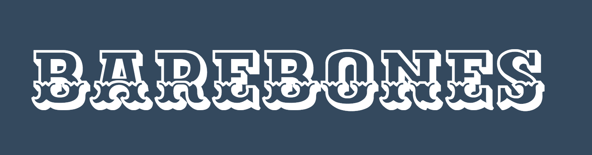

<p align="center">
	<a href=""></a>
</p>
# barebones-css

[barebones-css](https://mightycrow.github.io/barebones-css) - A minimal, responsive boilerplate for the modern web.

[](http://commitizen.github.io/cz-cli/)
[](https://travis-ci.org/mightyCrow/barebones-css)
[](https://badge.fury.io/gh/mightyCrow%2Fbarebones-css)
[](https://badge.fury.io/bo/barebones-css)
[](https://badge.fury.io/js/barebones-css) [](https://raw.githubusercontent.com/mightyCrow/barebones-css/master/LICENSE) [](https://github.com/mightyCrow/barebones-css/stargazers) [](https://github.com/mightyCrow/barebones-css/issues)

## What's so great about it?

- It provides you with a minimal set of styles for a fast and clean starting point.
- It's lightweight. Being **less than 5 kB** in size once gzipped.
- [sanitize.css](https://jonathantneal.github.io/sanitize.css/) is used to corrects broken and missing styles.
- It uses [Flexbox Grid](http://flexboxgrid.com/) to provide you with a responsive grid system.
- Build with [Less](http://lesscss.org/) for modularity and maintainability.
- No deeply nested selectors.
- Written entirely in rem and em values.
- It's Customization friendly with no evil **!Important**.
- Scalable on all devices and screens.

## Installation
**Install with cdn**

```html
<link rel="stylesheet" href="https://cdn.rawgit.com/mightyCrow/barebones-css/master/dist/barebones.min.css">
```

**Install with Bower**

```sh
$ bower install barebones-css
```

**Install with npm**

```sh
$ npm install barebones-css
```

**Install with yarn**

```sh
$ yarn add barebones-css
```

## Not catching your fancy?
Here are some other **awesome** options:
- [Skeleton](http://getskeleton.com/)
- [Milligram](https://milligram.github.io/)
- [Vital](https://vitalcss.com/)
- [Legacy Framework](https://legacy-framework.com/)
- [Spectre](https://picturepan2.github.io/spectre/)

# Contributing
Want to contribute to barebones? This project is still young and I welcome any help!

## License
Created with ♥ by [Tiaan du Plessis](https://github.com/mightyCrow). Licensed under the MIT License.
